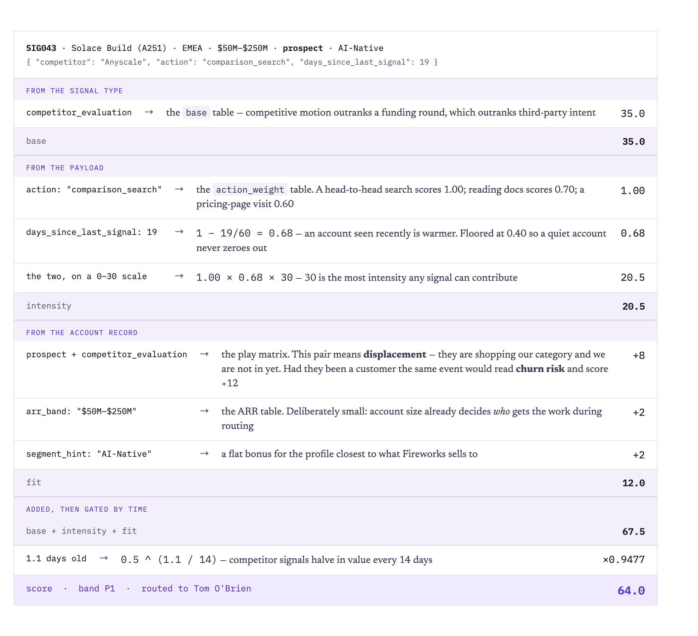
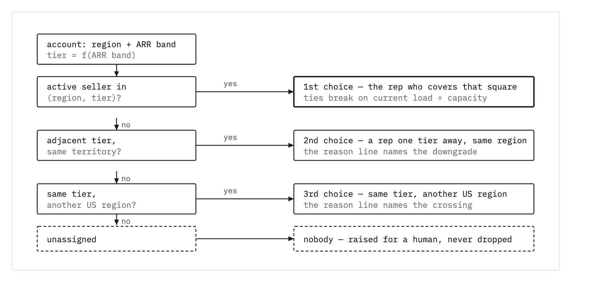

# DESIGN — Fuse (signal-to-seller routing)

## Background 
Signals arrive daily against accounts and
sellers, and nothing decides who acts on what. **This is a prototype that takes raw signals,
scores them, and routes each to the right seller.**

```
 usage_spike      ╮                                                               ╭─▶ seller
 job_change       │  ┌──────────┐    ┌───────┐    ┌──────────┐    ┌───────────┐   │
 intent_topic     ├─▶│ resolve  │ ─▶ │ score │ ─▶ │  bundle  │ ─▶ │   route   │───┼─▶ seller
 funding_event    │  └──────────┘    └───────┘    └──────────┘    └───────────┘   │
 competitor_eval  ╯   to account      payload      by account      region+tier    ╰─▶ seller
                           │                                            │
                           │ no account match                           │ no eligible seller
                           ▼                                            ▼
                      human review                                  unassigned
                           │                                            │
                           ╰─────▶Assign board — a person places it ◀───╯
```

Each seller ends the run with one ranked queue — P1 to act on today, P2 this
week, P3 to watch — and every item in it carries a named owner.


## Principles

1. **Every number is a business judgment** — all of them in `config.py`, with the
   reasoning beside them.
2. **Rank and explain together.** A number nobody can audit is a number nobody
   trusts, and a seller who distrusts the queue stops opening it.
3. **Refuse rather than guess.** Wrong-company outreach costs more than a delay.
4. **Sellers think in accounts**, so signals bundle per account.

## Scoring

`score = (base + intensity + fit) × recency`. The value terms are additive so the
result reads as a ledger; recency multiplies so a stale signal cannot ride a high
base to the top.

**base** What kind of signal is this? Some kinds are worth attention before you even read them.
**intensity** (0–30) How strong is this particular one? A traffic spike of 354% is not a spike of 78%.
**fit** (0–17) What does it mean for this account? The same event reads differently for a customer than for a prospect.
**recency** Is there still time? Not "how old is the fact" but "how much of the window to act on it is left".

One signal end to end, with every number traced back to the table it came from
(`scoring_audit.md` prints the same trace in text):



 `severity_hint` gets **zero weight** — it contradicts
its own payloads ($200M round tagged `low`, +354% spike `low`, 0.54 intent `high`).
Accounts bundle into one item, best signal counting fullest; bands are **percentile
cuts, not fixed scores** (P1 the top 20%) because fixed thresholds needed re-tuning
whenever a weight moved. They rank today's available work, not absolute urgency.

## Routing

Territory is the account's region. Tier comes from ARR band because `segment_hint`
(AI-Native / Enterprise-Expansion) shares no vocabulary with seller tiers
(Strategic / Enterprise / Mid-Market) — **the biggest assumption here**.




Capacity is taken to be a count of accounts — one work item is one unit whatever
its size or signal count — and it weights the tie-break rather than capping
anyone. `sellers.csv` never says what the unit is, so that reading is an
assumption; Every step writes its reason into `routes.csv`, so a fallback is
visible rather than absorbed. 

## Failure modes

1. **The identity join.** 15 of 50 signals match nothing, including all four usage
   spikes — whose payloads claim `is_customer: true`, so the billing↔CRM link is
   broken upstream. Volume worsens this long before scoring accuracy matters.
2. **No account-owner concept.** Nine customers route by region + tier as though
   net-new; `accounts.csv` has no owner field, so a churn alert can land on anyone
   but the account's AE.
3. **Load follows territory, not effort.** The router balances inside a cell but
   cannot balance across them. This run three active reps covered the region that
   produced one work item while one rep absorbed ten, and the account base does not
   explain it — 41 accounts against 64. At this sample size an empty queue is
   ordinary noise; persisting at daily volume it is a territory-design problem no
   router can fix. The dashboard therefore marks who received nothing and leaves
   the judgment to a person.
4. **Ambiguous semantics.** `job_change.direction` never says what it is relative
   to. We read "departed" as a real departure because the cheaper failure is a
   wasted check, not congratulating someone who has left — it inverts 7 of 11 job
   changes if wrong. One flag, guarded by a test.
5. **Hand-tuned constants** encode my judgment, not evidence.
6. **Static snapshot.** No dedup, no binding capacity, no reassignment on return.

## What I'd do differently

The weights are asserted, not fitted. With the same time again I would log what a
seller actually did with each routed item from the first run, so a week of real
outcomes could replace my judgment instead of sitting behind it.

## Future extensions

1. Put an identity service ahead of resolution and raise the billing↔CRM break as its own
alert. Or Integrate with CRM or Slack that can create accounts directly.
2. Adding manager level authority to manually redirect signals to seller that could be flexible enough to redirect when sellers are in Ramp or OOO status. 
3. Persist state for the unassigned signals. A real store is what unlocks the rest:
today each run is a standalone set of files, so there is no history to dedupe
against, no capacity that binds over time, and no record of what happened to an
item after it was routed.
4. Give every seller a named backup, so an OOO or ramping territory is covered by a
person instead of falling through to an adjacent tier, and hand the accounts back
when they return.
5. Write the openers with a live model. They are deterministic templates today; the
`--llm` path calls Fireworks' own inference API and falls back to the template on
any failure, but it ships off by default and has never run against the live
endpoint. 
6. Give the seller the account, not just the signal — what the company does, who it
sells to, what it announced this month. A rep opening a P1 on a prospect they have
never heard of currently has one payload fact and nothing else.
7. Make the view dynamic. The dashboard is a static file regenerated per run, which
is why the Assign board can only export CSV rather than write a decision back. A
served app with a session behind it would close that loop and let filters, claims
and dismissals persist.

## AI usage

Built with Claude Code. It was strongest at profiling the data fast — the
unroutable signals, the `severity_hint` contradictions, the vocabulary mismatch and
the coverage holes were all found and verified before any code — and at writing the
pipeline and tests once the shape was settled.

**The idea and shape was mine.** I set the stage boundaries and the rule that resolution
refuses rather than guesses, and I chose the additive-ledger scoring form over the
model's first proposal, a three-factor multiplication that buried the ranking
levers inside normalization constants. Deciding what the output had to be drove
most of the product: a **team overview** so a manager sees the day's P1 set, who
owns each item and where load actually sits; per-seller queues beneath it; and —
because a queue that quietly drops work is worse than no queue — an **Assign
board** where every unmatched or unassigned signal is dragged onto a named seller
and exported as CSV, so a human decision leaves the browser instead of dying in it.
Region is on every card there because it is the only routing dimension those
signals still have. I also cut the model's per-card "why this was routed to you"
note: sellers don't need the rationale, so it lives in `routes.csv` for RevOps.
Data audit and corrections were mine as well. Keep iterating with AI to refine the prototype. 


